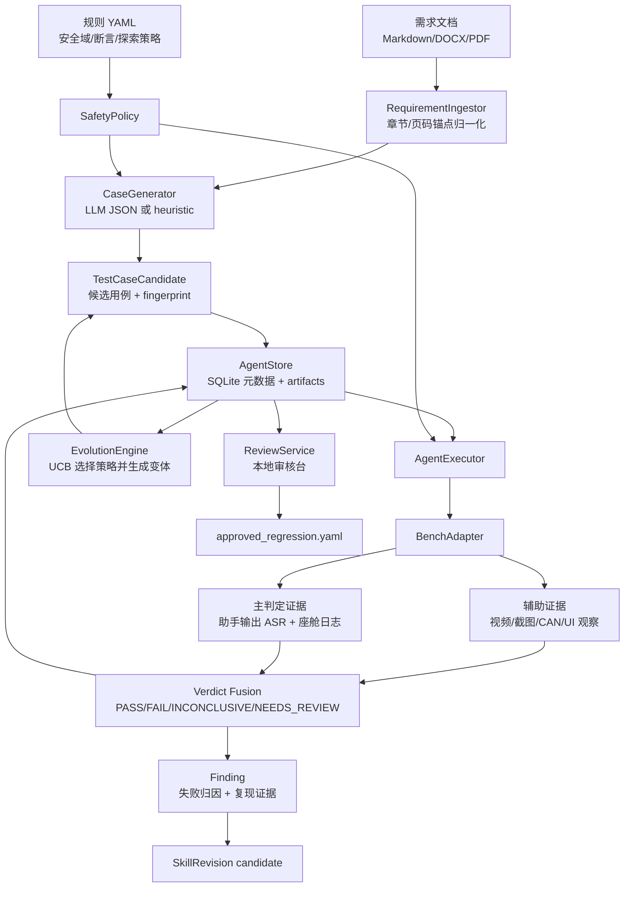

# CarVoice Bench — 车载语音自动化评测框架

> **ASR 延迟打点 · TTS 音频分析 · CAN 日志解析 · UI 状态校验 · 一站式报告**

`carvoice-bench` 面向车载语音助手测试，覆盖「用户语音 → ASR → TTS → CAN 执行 → UI 变化」的自动化评测链路，并输出结构化 JSON、CSV 和 HTML/PDF 报告。

当前项目支持两种运行方式：

- **Mock 模式**：不加载 Whisper、wav2vec2、OpenCV、CAN 工具链，可用于快速验证项目链路和报告生成。
- **真实模式**：接入真实音频、ASR 模型、CAN 日志、UI 截图和 DBC 配置，用于车机语音能力评测。

## 核心能力

| 模块 | 功能 | 说明 |
|------|------|------|
| ASR Bench | 语音识别、端到端延迟、WER/WER-C/CER | 支持 Whisper / Paraformer / Kaldi 类后端，mock 模式使用内置假结果 |
| TTS Analyzer | MOS、语速、停顿、音高、情感匹配 | MOS 优先使用 UTMOSv2，mock 模式生成稳定指标 |
| CAN Parser | ASC/BLF/CSV 日志解析、DBC 解码、信号匹配 | DBC 优先使用 `cantools`，无依赖时提供简化解析 |
| UI Verifier | 截图元素检测、前后状态变化校验 | 支持模板匹配 / YOLO ONNX / mock 校验 |
| Semantic Understanding | 意图识别、槽位抽取、语义匹配 | 支持 `expected_semantics` 轻量校验，后续可接真实 NLU |
| Full-Duplex | 用户打断、停顿处理、附和、背景语音 | 参考 Full-Duplex-Bench 的事件标注和时间窗校验 |
| Multi-turn Dialogue | 多轮上下文、最终状态一致性 | 支持 `dialogue.turns` 和 `expected_final_state` |
| Orchestrator | 统一编排多模态测试流程 | 聚合 ASR/TTS/CAN/UI 结果并生成时间轴 |
| Report | HTML/PDF/CSV/JSON 报告 | HTML 默认可生成，PDF 依赖 `weasyprint` |

## 快速开始

推荐先运行 mock demo，确认项目代码和报告链路正常：

```bash
python examples/mock_demo.py
```

成功后会看到类似输出：

```text
CarVoice Bench mock demo completed
cases: 3/3 passed
report: D:\ai_script\carvoice-bench\examples\mock_report\report.html
```

生成物位于：

- `examples/mock_report/report.html`
- `examples/mock_report/report_data.json`
- `examples/mock_report/asr_results.csv`
- `examples/mock_report/tts_mos_scores.csv`

## 安装

基础安装只包含命令行和 YAML 解析能力，避免一开始就拉取大模型依赖：

```bash
pip install -e .
```

按需安装扩展依赖：

```bash
pip install -e ".[audio]"
pip install -e ".[asr]"
pip install -e ".[tts]"
pip install -e ".[can]"
pip install -e ".[ui]"
pip install -e ".[report]"
pip install -e ".[online]"
pip install -e ".[dev]"
```

如果需要 GPU 版 PyTorch，请按目标 CUDA 版本参考 PyTorch 官方安装命令安装；项目的 `gpu` extra 只声明 `torch/torchaudio`，不在 `pyproject.toml` 中硬编码下载源。

`tts` extra 会从 UTMOSv2 官方 GitHub 仓库安装 `utmosv2`。如果测试环境不能联网，请提前在本地环境安装好该包和模型权重；未安装时项目会退回轻量启发式 MOS，并在结果中把 `method` 标记为 `heuristic_fallback`。

## 命令行用法

生成测试计划模板：

```bash
python -m carvoice_bench.cli init -o test_plan.yaml
```

运行 mock 链路：

```bash
python -m carvoice_bench.cli run --mock \
  --audio-dir ./examples/mock_audio \
  --test-plan ./examples/test_plan.yaml \
  --output-dir ./examples/mock_report
```

运行真实链路：

```bash
python -m carvoice_bench.cli run \
  --audio-dir ./test_run/audio \
  --can-log ./test_run/can_logs/drive.asc \
  --ui-before ./test_run/ui_screenshots/before.png \
  --ui-after ./test_run/ui_screenshots/after.png \
  --test-plan ./test_run/test_plan.yaml \
  --output-dir ./report \
  --model-asr whisper-base-zh \
  --device cpu
```

运行阿里云在线链路：

1. 在项目根目录创建 `.env`：

```bash
DASHSCOPE_API_KEY=你的阿里云百炼API-Key
ALIYUN_ASR_MODEL=paraformer-realtime-v2
ALIYUN_TTS_MODEL=cosyvoice-v3-flash
ALIYUN_TTS_VOICE=longanyang
ALIYUN_TTS_FORMAT=mp3
DASHSCOPE_WEBSOCKET_URL=wss://dashscope.aliyuncs.com/api-ws/v1/inference
ONLINE_PLAY_AUDIO=false
ONLINE_RECORD_SECONDS=0
ONLINE_RECORD_VIDEO=false
ONLINE_CAMERA_INDEX=0
ONLINE_VIDEO_FPS=20
ONLINE_CASE_PAUSE_SECONDS=0
```

如果使用新加坡地域，把 `DASHSCOPE_WEBSOCKET_URL` 改成：

```bash
DASHSCOPE_WEBSOCKET_URL=wss://dashscope-intl.aliyuncs.com/api-ws/v1/inference
```

2. 在线模式会优先使用 `--audio-dir` 中已有音频；如果某条用例没有同名音频，会调用阿里云 DashScope CosyVoice 生成语音文件，再用 DashScope Paraformer 云 ASR 识别，并把结果接入原有 WER/报告链路。

```bash
python -m carvoice_bench.cli run --online \
  --audio-dir ./test_run/audio \
  --test-plan ./test_run/test_plan.yaml \
  --output-dir ./report_online \
  --env-file .env
```

如需接近实车播放/采集流程，可打开本机默认声卡播放，并在播放后录制默认麦克风：

```bash
python -m carvoice_bench.cli run --online \
  --audio-dir ./test_run/audio \
  --test-plan ./test_run/test_plan.yaml \
  --output-dir ./report_online \
  --play-audio \
  --record-seconds 5
```

也可以使用快捷开关，等价于启用播放并录制 5 秒麦克风音频：

```bash
python -m carvoice_bench.cli run --online \
  --audio-dir ./test_run/audio \
  --test-plan ./test_run/test_plan.yaml \
  --output-dir ./report_online \
  --online-capture
```

如果要同时录当前 PC 摄像头视频，并在用例之间暂停 2 秒：

```bash
python -m carvoice_bench.cli run --online \
  --audio-dir ./test_run/audio \
  --test-plan ./test_run/test_plan.yaml \
  --output-dir ./report_online \
  --online-capture \
  --record-video \
  --case-pause-seconds 2
```

说明：`--play-audio` 和 `--record-seconds` 使用当前测试机的默认声卡/麦克风；`--record-video`/`--record-cabin-video` 使用当前 PC 摄像头，默认索引为 `0`，可用 `--camera-index` 调整。录音保存到 `report_online/recordings/`，视频保存到 `report_online/videos/`。真正的车机 UI 录屏、采集卡或 RTSP 流还需要继续接专用适配器。

从已有 `report_data.json` 重新生成报告：

```bash
python -m carvoice_bench.cli report --output-dir ./report --format html
```

## 测试计划格式

测试计划使用 YAML，核心字段是 `test_cases`：

```yaml
project:
  name: DemoCarVoiceTest
  version: 1.0.0

test_cases:
  - id: tc-001
    utterance: 打开主驾空调到26度
    expected_asr: 打开主驾空调到26度
    timeout_ms: 1500
    expected_can_signals:
      - frame_id: "0x2A1"
        signals:
          AC_MAIN_DRIVER: 1
          AC_TEMP_SET: 26
    expected_ui_changes:
      - element: ac_panel
        state: visible
      - element: temp_display
        value: "26℃"
```

mock 模式还支持在用例里指定稳定的假结果：

```yaml
mock_asr_result: 打开主驾空调到26度
mock_latency_ms: 286
mock_mos: 4.42
```

### 语义理解字段

```yaml
expected_semantics:
  intent: set_climate
  slots:
    zone: driver
    temperature: 26
```

mock 模式会默认把 `expected_semantics` 作为实际结果；也可以显式传入：

```yaml
mock_semantics:
  intent: set_climate
  slots:
    zone: driver
    temperature: 26
```

真实/在线模式下，如果用例没有显式提供 `actual_semantics`，框架会默认使用离线规则解析器从 ASR 文本中抽取语义：

```yaml
expected_semantics:
  intent: control_window
  slots:
    target: window
    zone: all
    action: close
```

命令行可选择语义解析器：

```bash
python -m carvoice_bench.cli run --online \
  --audio-dir ./test_run/audio \
  --test-plan ./test_run/test_plan.yaml \
  --output-dir ./report_online \
  --semantic-parser rule
```

`--semantic-parser none` 会关闭自动解析，只使用用例里的 `actual_semantics`；`--semantic-parser cloud` 预留给后续阿里云 LLM intent/slot 抽取适配器。

也可以通过 `--semantic-rules rules.yaml` 扩展词典规则：

```yaml
rules:
  - intent: open_trunk
    patterns:
      - "打开.*后备箱"
    slots:
      target: trunk
      action: open
```

### 全双工字段

全双工场景参考本地 `Full-Duplex-Bench/v1_v1.5` 的任务设计，支持用户打断、停顿处理、平滑轮次交替、附和、第三方说话、背景语音等事件。

```yaml
full_duplex:
  scenario: user_interruption
  expected_events:
    - type: user_interrupt
      start_ms: 800
      end_ms: 1300
  expected_behavior:
    barge_in_handled: true
  tolerance_ms: 500
```

常用 `scenario`：

- `pause_handling`
- `smooth_turn_taking`
- `user_interruption`
- `user_backchannel`
- `talking_to_other`
- `background_speech`

### 多轮会话字段

```yaml
dialogue:
  turns:
    - role: user
      text: 导航到公司
    - role: assistant
      text: 已开始导航到公司
  expected_final_state:
    domain: navigation
    active_route: company
```

mock 模式会默认使用 `expected_final_state` 作为实际最终状态；真实模式可以由后续 NLU/对话状态跟踪模块填入 `actual_dialogue`。

## 场景评价指标

### 语义理解

输入字段：

- `expected_semantics.intent`
- `expected_semantics.slots`
- `actual_semantics` 或 `mock_semantics`

计算指标：

| 指标 | 计算方法 |
|------|----------|
| `intent_accuracy` | `expected.intent == actual.intent` 时为 1，否则为 0 |
| `slot_precision` | 正确槽位键值对数 / 实际槽位键值对数 |
| `slot_recall` | 正确槽位键值对数 / 期望槽位键值对数 |
| `slot_f1` | `2 * precision * recall / (precision + recall)` |
| `slot_accuracy` | 正确槽位键值对数 / 期望槽位键值对数 |
| `joint_goal_accuracy` | intent 和全部 slots 同时完全匹配时为 1，否则为 0 |
| `match_rate` | intent accuracy 和 slot accuracy 的平均值 |

### 全双工语音

全双工评价参考 Full-Duplex-Bench 的核心思想：用事件时间窗和模型响应片段衡量系统是否在正确时间说话、停顿、接管或处理打断。

输入字段：

- `full_duplex.scenario`
- `full_duplex.expected_events`
- `full_duplex.expected_behavior`
- `actual_full_duplex` 或 `mock_full_duplex`

支持场景：

- `pause_handling`
- `smooth_turn_taking`
- `user_interruption`
- `user_backchannel`
- `talking_to_other`
- `background_speech`

计算指标：

| 指标 | 计算方法 |
|------|----------|
| `event_recall` | 在 `tolerance_ms` 内匹配到的期望事件数 / 期望事件数 |
| `behavior_accuracy` | 行为字段匹配数 / 期望行为字段数 |
| `take_over_rate` | 参考 Full-Duplex-Bench TOR：模型有有效响应片段时为 1，否则为 0；短于 1s 且不超过 3 个词的响应视为未正式接管 |
| `avg_event_latency_ms` | 实际事件开始时间 - 期望事件开始时间的平均值，负值按 0 计入聚合 |
| `stop_latency_ms` | `latency_stop_list` 或 `stop_intervals` 中 `(end - start)` 的平均毫秒数 |
| `response_latency_ms` | `latency_resp_list` 或 `response_intervals` 中 `(end - start)` 的平均毫秒数；没有区间时使用响应事件起点减用户事件终点 |
| `overlap_handling_score` | `1 - overlap_duration_ms / allowed_overlap_ms`，截断到 `[0, 1]` |
| `false_interruption_rate` | `false_interruptions / total_interruptions` |
| `backchannel_frequency_per_sec` | backchannel 事件数 / 音频时长 |
| `backchannel_jsd` | 期望 backchannel 时间分布和实际分布的 Jensen-Shannon divergence |
| `interruption_relevance_score` | 0 到 5 分；可由外部模型写入，也可用打断文本与响应文本词重叠做轻量估计 |
| `match_rate` | 基于事件召回、行为准确率，并按场景补充 TOR/JSD/误打断/相关性后的平均分 |

### 多轮会话

输入字段：

- `dialogue.turns`
- `dialogue.expected_final_state`
- `actual_dialogue` 或 `mock_dialogue`

计算指标：

| 指标 | 计算方法 |
|------|----------|
| `state_tracking_accuracy` | 最终状态字段匹配数 / 期望最终状态字段数 |
| `joint_goal_accuracy` | 整个最终状态完全匹配时为 1，否则为 0 |
| `context_carryover_accuracy` | 历史轮次关键词在实际上下文中保留的比例；也可由 `actual_dialogue.context_carryover_accuracy` 覆盖 |
| `task_completion_rate` | 优先使用 `actual_dialogue.task_completed` 或 `task_completion_rate`；否则回退到 `joint_goal_accuracy` |
| `turn_structure_accuracy` | 实际 turns 中包含 `role/text` 的轮次数 / 实际轮次数；实际轮次数不足时按比例扣分 |
| `match_rate` | 上述五项指标的平均值 |

## 数据集准备

项目预留了本地数据集工作区：

```text
datasets/
  asr/              # ASR 命令音频和 manifest
  noise/            # MUSAN/DEMAND/车舱噪声
  tts_mos/          # VoiceMOS/SOMOS/BVCC 等 MOS 数据
  can/              # CAN/OBD 日志和 DBC 文件
  ui/               # 车机 UI 截图和模板
  full_duplex/      # 全双工对话数据
  semantic/         # 意图/槽位测试 fixture
  dialogue/         # 多轮会话 fixture
  prepared/         # 转换后的 audio + test_plan.yaml
```

转换 Full-Duplex-Bench 数据：

```bash
python scripts/prepare_dataset.py \
  --adapter full-duplex \
  --source D:\ai_script\Full-Duplex-Bench\v1_v1.5\dataset \
  --output datasets/prepared/full_duplex \
  --task all \
  --limit 5 \
  --copy-audio
```

输出：

```text
datasets/prepared/full_duplex/
  audio/
  test_plan.yaml
  test_plan.json
  manifest.json
```

然后可以先用 mock 模式验证 schema：

```bash
python -m carvoice_bench.cli run --mock \
  --audio-dir datasets/prepared/full_duplex/audio \
  --test-plan datasets/prepared/full_duplex/test_plan.json \
  --output-dir datasets/prepared/full_duplex/report
```

`test_plan.yaml` 便于人工编辑；`test_plan.json` 适合基础安装环境，因为 CLI 无需 PyYAML 也能读取 JSON。

## 代码架构

```text
carvoice_bench/
  __init__.py                  # 包版本和 Config/Orchestrator/ReportGenerator 懒加载入口
  cli.py                       # click 命令行入口：run/report/init
  config.py                    # 全局 Config dataclass，包含 mock_mode 和各模块配置

  orchestrator/
    timeline.py                # 主编排器，负责执行测试用例、聚合结果、生成 report_data.json
    metrics.py                 # 语义理解、全双工、多轮会话客观指标计算

  asr_bench/
    engine.py                  # ASR 后端封装：Whisper / Paraformer / Kaldi
    latency.py                 # ASR 注入/回放延迟测量
    wer.py                     # WER、WER-C、CER 计算

  tts_analyzer/
    mos.py                     # MOS 预测，优先 UTMOSv2，失败时启发式回退
    prosody.py                 # 语速、音高、停顿、响度分析
    emotion.py                 # 情感风格匹配

  can_parser/
    parser.py                  # ASC/BLF/CSV/LOG 解析
    dbc.py                     # DBC 加载和信号解码
    matcher.py                 # 期望 CAN 信号与实际日志匹配

  ui_verifier/
    detector.py                # UI 元素检测和状态变化校验
    template_matcher.py        # OpenCV 模板匹配
    elements.yaml              # 内置车机 UI 元素定义

  report/
    report_api.py              # 报告统一入口，生成 HTML/PDF/CSV
    html_report.py             # HTML 报告生成
    pdf_report.py              # PDF 报告生成和文本回退

  utils/
    audio.py                   # 音频读取、重采样、VAD、RMS/SNR
    logger.py                  # 日志初始化

datasets/
  README.md                    # 数据集工作区说明
  asr/ noise/ tts_mos/ can/ ui/
  full_duplex/ semantic/ dialogue/ prepared/

examples/
  mock_demo.py                 # 无重依赖 mock demo
  test_plan.yaml               # 示例测试计划

scripts/
  prepare_dataset.py           # 外部数据集转换为 audio + test_plan.yaml

tests/
  test_all.py                  # 单元测试集合
```

### 主流程

```text
CLI / examples/mock_demo.py
        |
        v
Config + Orchestrator.run(...)
        |
        +-- ASR: 查找音频 -> 识别/延迟 -> WER/CER
        +-- TTS: UTMOSv2 MOS -> 韵律/停顿/音高
        +-- CAN: 解析日志 -> DBC 解码 -> 信号匹配
        +-- UI : 截图检测 -> 前后状态变化校验
        +-- NLU: intent/slot 语义匹配
        +-- Full-Duplex: 打断/停顿/附和/背景语音事件校验
        +-- Dialogue: 多轮上下文和最终状态校验
        |
        v
report_data.json + timeline + summary
        |
        v
ReportGenerator -> report.html / report.pdf / CSV
```

mock 模式在 `orchestrator/timeline.py` 内部使用 `_SimpleWERCalculator`、`_MockCANSignalMatcher`、`_MockUIDetector`，因此不会触发 ASR/TTS/UI/CAN 的重依赖导入。

## 输出数据

`report_data.json` 的主要结构：

```json
{
  "metadata": {},
  "summary": {},
  "cases": [],
  "asr": {},
  "tts": {},
  "can": {},
  "ui": {},
  "semantics": {},
  "full_duplex": {},
  "dialogue": {},
  "timeline": {}
}
```

每条 case 包含：

- `passed`：是否通过
- `fail_reasons`：失败原因
- `asr`：识别结果、延迟、WER/CER
- `tts`：MOS、MOS 计算方法、韵律指标、自然度和平滑度
- `can`：信号匹配率和详情
- `ui`：UI 变化校验结果
- `semantics`：意图和槽位匹配结果
- `full_duplex`：全双工事件和行为匹配结果
- `dialogue`：多轮会话结构和最终状态结果
- `timeline`：该用例的链路事件

## 开发验证

基础验证：

```bash
python -m compileall carvoice_bench examples
python examples/mock_demo.py
```

安装开发依赖后运行测试：

```bash
pip install -e ".[dev,audio,ui]"
python -m pytest -q
```

## 后续接入建议

- 真实 ASR 模式建议优先配置本地模型缓存，避免测试机临时联网下载模型。
- CAN 信号校验建议提供正式 DBC，并用真实日志样例补充单元测试。
- UI 校验建议为不同车机主题维护独立 `elements.yaml` 和模板目录。
- 报告模板后续可迁移到独立 Jinja2 模板文件，便于品牌化定制。

## 自我进化测试 Agent

`carvoice-bench 0.5.0` 增加了一个本地优先、人工审批的测试 Agent。它把 Markdown、DOCX 或 PDF 需求归一化为可追溯条目，生成受安全规则约束的候选用例，复用现有语音链路和座舱证据链路收集证据，并只把审核通过的候选导出到回归集。默认建议把用例结果的主判定放在两类证据上：语音助手 TTS 输出经录音和 ASR 后的文本结果，以及座舱/车机日志中的意图、槽位、执行状态或错误码；摄像头视频、截图和可见车控状态主要作为辅助证据。

### Agent 架构

自我进化测试 Agent 当前采用 Python 持久化状态机实现，没有引入 LangChain 或 LangGraph。核心原则是“Agent 可以生成候选和策略，但不能直接修改执行代码，也不能自动批准回归用例”。所有状态写入本地 SQLite，音频、截图、视频、报告和日志等大文件写入按 `run_id/candidate_id/attempt` 分区的工件目录。



主要模块职责如下：

| 模块 | 代码位置 | 职责 |
|------|----------|------|
| 需求摄取 | `carvoice_bench/agent/requirements.py` | 解析 Markdown、TXT、DOCX、PDF，生成带 `source_ref` 的 `Requirement`。 |
| 用例生成 | `carvoice_bench/agent/generator.py` | 基于规则默认值、需求文本和可选 LLM 生成 `TestCaseCandidate`；只接受 JSON 结构化输出。 |
| 安全策略 | `carvoice_bench/agent/safety.py` | 校验 domain、驻车/台架前置条件、超时、必需 oracle、拒识用例无 CAN/UI 执行断言。 |
| 本地记忆 | `carvoice_bench/agent/storage.py` | SQLite 保存 run、requirement、candidate、execution、finding、strategy、skill、review、audit。 |
| 执行编排 | `carvoice_bench/agent/execution.py` | 执行前做安全门检查，按 repetition 收集证据，2/3 稳定失败时生成 finding。 |
| 台架适配 | `carvoice_bench/agent/bench.py` | `OrchestratorBenchAdapter` 把 Agent 用例转给现有 Orchestrator，统一语音 ASR、座舱日志、CAN/UI、dialogue/full-duplex 结果。 |
| 裁决融合 | `carvoice_bench/agent/verdict.py` | 只对 `mandatory_oracles` 中声明的主判定 oracle 做硬裁决；全部通过才 PASS，高置信反证为 FAIL，缺证据为 INCONCLUSIVE，低置信冲突为 NEEDS_REVIEW。 |
| 进化策略 | `carvoice_bench/agent/evolution.py` | 维护策略库，用 UCB 选择下一探索方向，生成候选变体，记录 reward 和 Skill 候选。 |
| 审核台 | `carvoice_bench/agent/review.py` | 本机 HTTP 页面查看候选、执行证据、finding 和审核动作，批准后导出回归 YAML。 |

核心数据模型包括：

- `Requirement`：需求条目，保存原始文档路径、章节/页码锚点和正文。
- `TestCaseCandidate`：候选用例，保存用例 YAML 字段、来源需求、策略链、父候选和 fingerprint。
- `ExecutionEvidence`：一次执行证据，保存 oracle 结果、工件路径、设备安全状态和时间线。
- `Finding`：稳定复现的缺陷候选，包含失败类别、原因假设和证据 ID。
- `Strategy`：探索策略，包含状态、尝试次数、累计奖励和可配置参数。
- `SkillRevision`：从稳定问题中沉淀出的候选测试技能，只能以 candidate 状态写入。
- `Verdict`：`PASS`、`FAIL`、`INCONCLUSIVE`、`NEEDS_REVIEW`。

Agent 的运行状态机是：

```text
ingest -> generated candidate -> safety checked candidate
      -> executed / needs_review / rejected
      -> evolve creates child candidate
      -> stable failure creates finding and skill candidate
      -> human review approves/rejects/requests revision
      -> approved candidate exports to regression YAML
```

进化循环是受控的 ReAct 变体：

```text
观察执行结果
  -> 归因失败类型
  -> 读取历史 strategy reward 和候选 fingerprint
  -> UCB 选择探索策略
  -> 生成结构化变体
  -> SafetyPolicy 静态校验
  -> BenchAdapter 执行并收集多模态证据
  -> Verdict 融合裁决
  -> reward 回写策略
  -> finding/skill/candidate 进入审核队列
```

内置策略分为表达参数、语义理解、交互安全和指标切片四类。指标切片策略会把 `test_parameters.metric_slice` 写入候选用例，使审核台和后续报告能按“意图/槽位准确率、多轮保持率、澄清正确率、误唤醒率、音区串扰率、执行一致性、降级真实性”回看结果。视频和截图不默认进入硬裁决；只有当项目把 `ui`、`can` 或其他视觉/车控 oracle 放进 `mandatory_oracles` 时，它们才会影响 PASS/FAIL。

### 可行性检查

从当前代码状态看，Agent 的本地闭环已经具备工程可行性：需求摄取、候选生成、安全校验、执行证据入库、失败复现判定、策略 UCB 选择、审核导出这些环节都有实现和单元测试覆盖。真实台架落地也可行，但需要注意下面这些边界。

| 项目 | 当前状态 | 可行性判断 | 建议 |
|------|----------|------------|------|
| 需求到候选 | Markdown/TXT/DOCX/PDF 已支持；LLM 输出要求 JSON。 | 可用。 | Excel 用例表尚未直接 ingest，需要先转 Markdown/YAML，或补 `xlsx` ingestor。 |
| 安全门 | 有静态规则校验和 `safe_to_test` 适配器门禁。 | 可用但偏保守。 | 实车台架建议从 CAN/VSS 动态读取挡位、车速、电源状态，替代人工填写的静态布尔值。 |
| 语音主判定 | 在线模式可 TTS 生成、PC 播放、麦克风录音、云 ASR，并形成 `voice` oracle。 | 可用。 | 需要做声压、距离、噪声、回声和车机唤醒词校准，否则失败可能来自台架声学链路。 |
| 座舱日志主判定 | `bench.yaml` 可配置 `cockpit_log`/`cabin_log`/`device_log`，用例用 `expected_cockpit_log_patterns` 声明期望日志片段。 | 可用，当前是轻量文本匹配。 | 正式台架建议接车型日志解析器，把 intent、slots、执行结果、错误码解析成结构化 oracle。 |
| CAN/UI 辅助证据 | Adapter 可读取 `can_log`、`ui_before`、`ui_after`。 | 半自动。 | 默认建议作为辅助证据；只有关键车控需要强判定时再放入 `mandatory_oracles`。当前不会自动启动/停止 CAN logger 或截图工具，需要外部脚本或车型专用 Adapter 刷新证据文件。 |
| 视频辅助证据 | 在线链路可录 PC 摄像头视频并保存工件。 | 证据可保存，自动判定有限。 | 主要用于人工观察文字上屏、车窗/座椅/空调等实际状态；若要自动判定，需要补视频关键帧、OCR 和车控状态抽取适配器。 |
| 语义理解 | Rule parser、`expected_semantics`、`expected_semantic_sequence` 已支持。 | 可用但覆盖有限。 | 对复杂语义、歧义澄清、多轮上下文，建议接入车机 NLU 日志或云端结构化语义输出。 |
| 多轮/全双工 | 指标函数和用例字段已支持。 | 测试框架可承载，真实自动采集不足。 | 真实台架需要对话状态跟踪、VAD/说话人事件、音区事件提取，否则会变成缺证据。 |
| 进化 reward | UCB、priority、attempt budget、稳定失败奖励已实现。 | 可用作探索调度。 | 当前新增覆盖度 `novelty` 仍是简化值，后续应接入需求覆盖矩阵、语义槽位覆盖和场景覆盖统计。 |
| 状态恢复 | 用例有 `cleanup` 字段。 | 目前主要是声明。 | 真车连续探索前需要 Adapter 执行恢复动作，或在每轮前校验初始状态，避免串扰。 |
| Skill 沉淀 | 稳定 finding 可生成 `SkillRevision candidate`。 | 数据结构已具备。 | 审核台当前主要审核候选用例，Skill 的专用差异视图、批准/退休流程还应补齐。 |
| 审计 | SQLite audit 记录 create/ingest/propose/execute/review/score。 | 本地追溯可用。 | 如果用于正式质量流程，应增加只读归档、签名或外部日志落库，防止本地 SQLite 被篡改。 |
| 回归晋级 | 只有审核批准的 candidate 会导出 `approved_regression.yaml`。 | 可用。 | 建议把导出的回归集纳入版本管理，并在 CI/台架流水线中固定规则版本和模型版本。 |

结论：当前实现适合作为 V1 台架探索测试 Agent，尤其适合“用例生成、证据归档、失败复现、人工审核晋级”的闭环。推荐的 V1 主判定组合是 `voice + cockpit_log`：前者判断语音助手播报内容，后者判断座舱日志里的语义理解和执行结果；视频、截图、CAN/UI 先作为辅助证据。最需要补强的是车型/台架专用 Adapter：自动采集座舱日志、动态安全状态、清理动作，以及可选的 CAN、截图和视频关键帧。

### 真实台架使用流程

下面示例是实体车机 PC 台架方案，不使用 `--mock`。链路是：Agent 从需求生成候选用例，DashScope TTS 生成语音并从测试 PC 扬声器播放，车机语音助手响应后由测试 PC 麦克风录音并做 ASR；同时读取座舱日志作为主执行证据。摄像头视频、截图、CAN/UI 片段用于辅助观察，例如文字是否上屏、车窗是否打开、空调页面是否变化，最后由本地审核台批准可进入回归的用例。

真实运行前建议安装 Agent、在线语音、音频播放/录音、CAN、UI 和报告依赖：

```bash
pip install -e ".[agent,online,audio,can,ui,report]"
```

如果用本地 ASR 模型而不是在线 ASR，再额外安装：

```bash
pip install -e ".[asr]"
```

台架至少需要这些输入：

- 测试 PC：能访问模型服务，已配置默认扬声器、麦克风和可选摄像头。
- 车机状态：实体车机或座舱台架处于驻车/台架模式，禁止道路行驶中测试。
- 音频链路：测试 PC 扬声器对准车机麦克风，测试 PC 麦克风能录到语音助手播报。
- 主判定证据：座舱/车机日志，以及语音助手输出录音经 ASR 识别后的文本。
- 辅助证据：CAN 日志、UI 前后截图或摄像头录像按设备能力接入，用于人工复核文字上屏和车控实际执行结果。当前 `BenchAdapter` 会读取 `bench.yaml` 中声明的 `cockpit_log`、`can_log`、`ui_before`、`ui_after`；如果这些文件由外部采集脚本生成，执行前确保路径指向本轮最新证据。
- 安全门：`bench.yaml` 必须显式设置 `safe_to_test: true`，否则 Agent 会拒绝执行。

准备一个目录：

```text
test_run/real_agent/
  requirements/ac_control.md
  rules.yaml
  bench.yaml
  semantic_rules.yaml
  audio/
  logs/ac_control.log
  can/ac_control.asc
  ui/ac_before.png
  ui/ac_after.png
  workspace/
```

配置 `.env`，用于候选生成和在线 TTS/ASR：

```bash
DASHSCOPE_API_KEY=你的 DashScope API Key
ALIYUN_ASR_MODEL=paraformer-realtime-v2
ALIYUN_TTS_MODEL=cosyvoice-v3-flash
ALIYUN_TTS_VOICE=longxiaochun_v2
ALIYUN_TTS_FORMAT=mp3
DASHSCOPE_WEBSOCKET_URL=wss://dashscope.aliyuncs.com/api-ws/v1/inference
```

真实台架 `bench.yaml` 示例：

```yaml
safe_to_test: true
env_file: .env

# 在线链路：TTS 音频会播放到默认扬声器，随后录制麦克风回放作为 ASR 输入。
play_audio: true
record_seconds: 6
record_video: true
camera_index: 0
video_fps: 20

# 主判定日志。可由 adb logcat、车机诊断日志、座舱中间件日志或自动化采集脚本提前写入。
cockpit_log: test_run/real_agent/logs/ac_control.log

# 辅助观察证据。需要强判定时，再把 can/ui 放进 mandatory_oracles。
can_log: test_run/real_agent/can/ac_control.asc
ui_before: test_run/real_agent/ui/ac_before.png
ui_after: test_run/real_agent/ui/ac_after.png

semantic_parser: rule
semantic_rules: test_run/real_agent/semantic_rules.yaml
```

实际案例：验证“主驾空调温度和风量同时设置”，并允许 Agent 围绕语义、边界值、多轮保持、执行一致性继续探索。

`test_run/real_agent/requirements/ac_control.md`：

```markdown
# 主驾空调温度和风量控制

用户在驻车台架说“把主驾空调调到23度并开二挡风”后，语音助手应播报设置完成；座舱日志应记录 intent=control_climate，并保留 zone=driver、temperature=23、fan_level=2 三个槽位和执行成功状态。摄像头视频或截图可辅助观察车机文字上屏、空调页面变化和风量显示。
```

`test_run/real_agent/rules.yaml`：

```yaml
safety:
  allowed_domains: [climate, window, seat, media, navigation, information, communication, vehicle_status, ambient, app, cross_domain]
  required_vehicle_states: [bench, parked]
  max_timeout_ms: 10000

defaults:
  domain: climate
  expected_response: "已为您设置完成"
  # 主判定：助手输出录音的 ASR 结果 + 座舱日志。
  # 视频、截图、CAN/UI 默认作为辅助证据，不放入 mandatory_oracles。
  mandatory_oracles: [voice, cockpit_log]
  preconditions:
    vehicle_state: bench
  cleanup: "恢复空调到测试前状态"
  timeout_ms: 6000
  expected_semantics:
    intent: control_climate
    slots:
      action: set
      target: ac
      zone: driver
      temperature: 23
      fan_level: 2
  expected_cockpit_log_patterns:
    - "intent=control_climate"
    - "zone=driver"
    - "temperature=23"
    - "fan_level=2"
    - "execute_status=success"
  # 以下为辅助观察断言；只有把 can/ui 加入 mandatory_oracles 时才影响 Agent PASS/FAIL。
  expected_can_signals:
    - frame_id: "0x2A1"
      signals:
        AC_MAIN_DRIVER: 1
        AC_TEMP_SET: 23
        AC_FAN_LEVEL: 2
  expected_ui_changes:
    - element: driver_temp_display
      value: "23℃"
    - element: driver_fan_level
      value: "2"

exploration:
  ucb_exploration_coefficient: 1.2
  enabled_strategies:
    - synonym
    - slot_boundary
    - intent_slot_accuracy
    - multi_turn_retention
    - clarification_correctness
    - degradation_authenticity
  strategies:
    synonym:
      priority: 1.2
      max_attempts: 4
      replacements:
        - {from: "调到", to: "设置为"}
        - {from: "开", to: "打开"}
    slot_boundary:
      priority: 1.1
      values:
        climate: [18, 30]
      safe_range: [16, 30]
```

`test_run/real_agent/semantic_rules.yaml` 可按项目语义解析器扩展词典，例如：

```yaml
rules:
  - intent: control_climate
    patterns:
      - ".*空调.*"
      - ".*温度.*"
    slots:
      action: set
      target: ac
```

执行步骤如下。第一步摄取需求，命令会输出 `run_id`：

```bash
carvoice-bench agent ingest \
  --requirements test_run/real_agent/requirements/ac_control.md \
  --rules test_run/real_agent/rules.yaml \
  --workspace test_run/real_agent/workspace
```

第二步生成候选用例。真实项目建议优先用受控 LLM 生成结构化候选；如果内网模型兼容 OpenAI API，可把 `--provider` 改成 `compatible` 并传入 `--endpoint`。

```bash
carvoice-bench agent generate \
  --workspace test_run/real_agent/workspace \
  --run-id <run_id> \
  --rules test_run/real_agent/rules.yaml \
  --provider dashscope \
  --model qwen-plus \
  --env-file .env
```

第三步查看候选 ID。当前 CLI 会返回数量，候选详情可从审核台查看，也可以用下面命令列出：

```bash
python -X utf8 -c "from carvoice_bench.agent.storage import AgentStore; s=AgentStore('test_run/real_agent/workspace'); [print(c.id, c.case.get('utterance'), c.case.get('mandatory_oracles')) for c in s.list_candidates('<run_id>')]"
```

第四步执行某个候选。注意这里使用 `--online --bench`，不要加 `--mock`：

```bash
carvoice-bench agent execute \
  --workspace test_run/real_agent/workspace \
  --run-id <run_id> \
  --candidate <candidate_id> \
  --rules test_run/real_agent/rules.yaml \
  --audio-dir test_run/real_agent/audio \
  --bench test_run/real_agent/bench.yaml \
  --online \
  --repetitions 3
```

执行时会发生这些事：

- 如果 `audio/` 下没有该用例音频，在线链路会用 TTS 生成语音文件。
- `play_audio: true` 时，测试 PC 播放 TTS 音频唤起车机语音助手。
- `record_seconds` 大于 0 时，测试 PC 录制麦克风音频，并把这段真实台架录音送入 ASR，形成 `voice` oracle。
- `cockpit_log` 会按 `expected_cockpit_log_patterns` 做文本匹配，形成 `cockpit_log` oracle。
- `can_log`、`ui_before`、`ui_after`、视频路径会被纳入统一证据；默认不影响 PASS/FAIL，除非项目把对应 oracle 放进 `mandatory_oracles`。
- `voice`、`cockpit_log` 等必需 oracle 任一高置信失败都会导致 FAIL，缺证据会进入 INCONCLUSIVE/NEEDS_REVIEW。
- 同一候选 `--repetitions 3` 下至少 2/3 稳定复现失败，才会形成缺陷候选。

第五步让 Agent 在真实台架上做受控探索。建议先小步运行，每次 2 到 5 次迭代；如果座舱日志、CAN/UI 或视频证据需要外部采集脚本刷新，先刷新 `bench.yaml` 指向的文件，再运行下一轮。

```bash
carvoice-bench agent evolve \
  --workspace test_run/real_agent/workspace \
  --run-id <run_id> \
  --rules test_run/real_agent/rules.yaml \
  --audio-dir test_run/real_agent/audio \
  --bench test_run/real_agent/bench.yaml \
  --online \
  --max-iterations 5
```

这一步会按 UCB 在已启用策略中选择探索方向，例如同义改写、温度边界、多轮保持、澄清正确率和降级真实性等。奖励由新增覆盖、稳定唯一失败、裁决置信度和执行成本组成；探索产生的用例都只是候选，不会自动进入回归集。

第六步打开本地审核台：

```bash
carvoice-bench review \
  --workspace test_run/real_agent/workspace \
  --run-id <run_id> \
  --host 127.0.0.1 \
  --port 8765
```

在浏览器打开 `http://127.0.0.1:8765`，逐条查看需求追溯、候选用例、执行证据、音频转写、座舱日志匹配、视频/截图路径、CAN/UI 片段、失败归因和策略来源。审核通过后点击导出，生成：

```text
test_run/real_agent/workspace/approved_regression.yaml
```

这个文件才是后续回归执行的输入；审核前的候选、低置信结果、环境异常和未复现失败都不会自动晋级。

真实台架运行必须在 bench YAML 中显式设置 `safe_to_test: true`，且安全规则仅允许座舱非行驶域：空调、车窗、座椅、媒体、导航和信息查询。Agent 只能提出候选用例、探索策略和 Skill 修订；它不会自动批准回归用例、绕开安全门或修改执行代码。

### 探索策略配置

在规则文件的 `exploration` 下配置 UCB 与策略。`enabled_strategies` 是唯一可被选择的策略集合；每个策略可设置 `priority`、`max_attempts` 和本策略的变异参数。未启用的策略会在工作区中标记为 `retired`，历史奖励仍会保留。

```yaml
exploration:
  ucb_exploration_coefficient: 1.2
  enabled_strategies: [synonym, interruption, cabin_noise_profile]
  strategies:
    synonym:
      priority: 1.5
      max_attempts: 8
      replacements:
        - {from: "打开", to: "开启"}
    interruption:
      events:
        - {type: user_interrupt, start_ms: 500, end_ms: 950}
      tolerance_ms: 400
    cabin_noise_profile:
      type: case_patch
      priority: 0.8
      case_patch:
        test_parameters:
          noise_profile: cabin_low
          speaker_distance_cm: 70
```

内置策略分为四类：

- 表达与参数：`synonym`、`slot_boundary`、`noise_rate`、`state_combination`、`negative_command`。
- 语义理解：`compound_command`、`constraint_negation`、`semantic_slot_completeness`、`fuzzy_intent`、`context_reference`、`context_correction`。
- 交互与安全：`multi_turn`、`interruption`、`cross_domain_chain`、`rejection_boundary`。
- 指标切片：`intent_slot_accuracy`、`multi_turn_retention`、`clarification_correctness`、`false_wakeup_rate`、`audio_zone_crosstalk_rate`、`execution_consistency`、`degradation_authenticity`。

语义策略支持 `expected_semantic_sequence`，用于按顺序验证一句多指令的子意图；上下文策略使用 `dialogue` Oracle；拒识策略使用 `safety` Oracle，并且不得同时期望 CAN 或 UI 的车辆执行。指标切片策略会在候选用例的 `test_parameters.metric_slice` 中写入来源、切片名、中文标签、主 oracle 和聚合口径，便于按“关联指标”回看意图/槽位准确率、多轮保持率、澄清正确率、误唤醒率、音区串扰率、执行一致性和降级真实性。该集合根据根目录的《车载智能座舱大模型交互意图理解与执行能力测试评价方法》和《语音助手测试用例.xlsx》中的功能场景扩展而来。自定义策略只能使用结构化 `case_patch`，不能携带脚本或任意工具调用；补丁仍会经过完整安全校验和去重。

工作区包含 SQLite 记忆、按运行保存的报告/音视频等工件、不可变审计记录，以及由本机审核台导出的 `approved_regression.yaml`。审核台只绑定 `127.0.0.1`。

## 许可

MIT License
