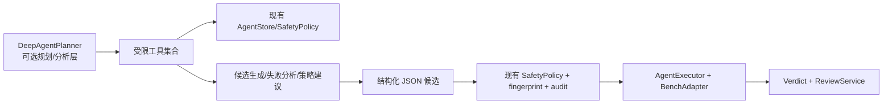

# Deep Agents 替换自我进化测试 Agent 可行性调研

调研日期：2026-06-27

## 结论

不建议当前把 `carvoice-bench` 已实现的 Python 状态机 Agent 直接替换为 Deep Agents。更合适的路线是把 Deep Agents 作为 V2 的可选规划/分析层，用于需求理解、失败分析、策略建议和 Skill 文档沉淀；台架执行、安全门、主判定、审核晋级和审计仍由本项目现有确定性代码掌控。

原因有三点：

- 车载台架测试的关键风险在安全和审计，而不是单纯规划能力。`SafetyPolicy`、`safe_to_test`、`mandatory_oracles`、人工审核和 SQLite audit 不能被通用 agent loop 取代。
- Deep Agents 的优势是长任务规划、子 Agent、文件系统、记忆、Human-in-the-loop、Skills 和工具/MCP 编排，这些更适合放在“候选生成/分析建议”层。
- `deepagents` 当前 Python 包要求 Python `>=3.11,<4.0`，而本项目 `pyproject.toml` 是 `requires-python >=3.9`。直接依赖会提高项目运行门槛。

## 调研对象

这里的 Deep Agents 指 LangChain 生态中的 `deepagents`，它构建在 LangGraph 之上，提供通用 deep agent harness。官方资料强调它通过规划工具、上下文工程、子 Agent、文件系统、记忆、HITL 和 Skills 来支持复杂长任务。

参考资料：

- [LangChain Deep Agents overview](https://docs.langchain.com/oss/python/deepagents/overview)
- [deepagents PyPI](https://pypi.org/project/deepagents/)
- [deepagents GitHub](https://github.com/langchain-ai/deepagents)

## 当前 Agent 边界

本项目当前 Agent 是本地优先的 Python 持久化状态机：

- `RequirementIngestor`：解析 Markdown/TXT/DOCX/PDF，生成带来源锚点的需求条目。
- `CaseGenerator`：使用 heuristic 或 LLM JSON 输出生成候选用例。
- `SafetyPolicy`：静态安全校验，约束 domain、前置状态、超时、必需 oracle 和拒识用例。
- `AgentStore`：SQLite 保存 run、requirement、candidate、execution、finding、strategy、skill、review、audit。
- `AgentExecutor`：执行前检查安全门，重复执行并根据稳定失败生成 finding。
- `BenchAdapter`：把候选用例转给真实台架或现有 Orchestrator，收集主判定和辅助证据。
- `Verdict`：只对 `mandatory_oracles` 做硬裁决。
- `EvolutionEngine`：用 UCB 在策略库中选择下一探索方向，生成候选变体。
- `ReviewService`：人工审核候选，批准后导出 `approved_regression.yaml`。

当前推荐主判定是 `voice + cockpit_log`：

- `voice`：TTS 播放后录制语音助手输出，再由 ASR 识别判断回复内容。
- `cockpit_log`：从座舱/车机日志判断 intent、slots、执行状态和错误码。
- 视频、截图、CAN/UI 默认作为辅助证据，主要用于人工观察文字上屏和车控实际状态。

## 对比分析

| 维度 | 当前 Python 状态机 Agent | Deep Agents | 替换判断 |
|------|--------------------------|-------------|----------|
| 状态和审计 | SQLite schema 明确，run/candidate/execution/finding/review/audit 可追溯。 | 有 LangGraph 持久化和记忆能力，但需要重新映射到本项目审计模型。 | 不应丢弃现有 `AgentStore`。 |
| 安全门 | `SafetyPolicy`、`safe_to_test`、`mandatory_oracles`、人工审核都是硬规则。 | 依赖工具权限、sandbox 和 HITL；模型本身不能作为安全边界。 | 车载测试必须保留硬规则。 |
| 规划能力 | UCB + 内置变体，稳定、可解释，但创造性有限。 | 规划、子 Agent、上下文管理更强，适合需求拆解、失败分析和策略建议。 | 适合补规划层。 |
| 执行确定性 | 执行路径固定：安全校验 -> 台架适配 -> 裁决 -> 审核。 | 通用 agent loop 更灵活，但可重复性和边界要靠工具封装。 | 不建议直接替换执行层。 |
| Python 版本 | 项目当前 `requires-python >=3.9`。 | PyPI 标注 `Requires: Python <4.0, >=3.11`。 | 直接依赖会提高运行门槛。 |
| 工具权限 | 当前没有任意 shell/代码执行能力。 | 支持文件系统、工具/MCP、可能的 shell 或代码工具组合。 | 台架环境必须默认禁用裸 shell 和任意文件写。 |
| Skills | 当前有 `SkillRevision candidate` 数据结构，但审核视图较薄。 | Skills 是一等能力，可按需加载。 | 可借鉴或集成，但仍需本项目审批状态。 |
| 生产观测 | 当前本地可追溯，报告已有。 | 可接 LangSmith tracing/evaluation/deployment。 | 可作为增强项，不应成为必需依赖。 |

## 推荐架构

推荐采用“Deep Agents Planner + 现有安全状态机”的分层架构。

Deep Agents 只允许产出结构化建议，不直接控制台架：

- 读取需求、规则和历史执行摘要。
- 读取失败归因、ASR 转写、`cockpit_log` 摘要和证据索引。
- 生成候选用例 JSON、策略参数变更建议、失败分析说明和审核摘要。
- 生成 `SkillRevision candidate` 的说明、输入输出契约、安全约束和已验证例子。

Deep Agents 禁止执行这些动作：

- 直接运行台架或调用 `agent execute/evolve`。
- 直接修改 approved 回归集。
- 直接修改执行代码。
- 直接调用 shell。
- 任意读写工作区外文件。
- 绕过 `SafetyPolicy.validate()`、fingerprint 去重和审核台。

## 分阶段落地计划

### 阶段 1：Planner PoC

目标：只替换“策略建议/失败分析”的一小段，不改台架执行。

允许工具：

- `read_requirements(run_id)`
- `read_candidates(run_id)`
- `read_execution_summaries(run_id)`
- `read_findings(run_id)`
- `propose_candidate_json(...)`
- `propose_strategy_patch(...)`

所有输出仍然进入现有 `CaseGenerator`/`SafetyPolicy`/`AgentStore`。

验收指标：

- Deep Agents 生成候选的安全校验通过率不低于当前 LLM/heuristic。
- 重复候选率低于当前策略。
- 人工审核认为“有价值”的候选比例提升。
- 不出现未授权 domain、危险命令、无前置条件、无 cleanup、无 mandatory oracle 的候选。

### 阶段 2：子 Agent 拆分

可拆成四个只读/建议型子 Agent：

- `RequirementAnalyst`：提炼 domain、前置状态、断言、主判定 oracle 和覆盖维度。
- `SemanticAdversary`：提出同义、歧义、槽位边界、多轮上下文、降级真实性变体。
- `LogAnalyst`：根据 `cockpit_log`、ASR 转写和失败原因，推断 ASR/NLU/执行/环境问题。
- `RegressionCurator`：为审核台生成差异摘要、风险说明和回归优先级。

所有子 Agent 都只能返回 JSON 或 Markdown 说明，不能调用台架执行工具。

### 阶段 3：有限编排替换

只有满足这些条件后，才考虑让 Deep Agents 替换更大一部分编排：

- 项目 Python 版本可以提升到 3.11+，或 `deepagents` 作为完全可选 extra 隔离。
- 车型 Adapter 已能自动采集座舱日志、动态安全状态、清理动作和必要辅助证据。
- 所有 Deep Agents 工具都经过权限封装，没有裸 shell、裸文件系统、未审批执行工具。
- 对比实验显示 Deep Agents 方案在缺陷发现率、有效候选率、误报率和人工审核耗时上优于当前 UCB 策略。
- 审计要求不退化：所有候选、执行、reward、review、Skill 变更仍可追溯。

## 风险清单

| 风险 | 影响 | 缓解 |
|------|------|------|
| Agent 越权执行台架 | 可能触发非预期车控动作。 | Deep Agents 不暴露执行工具；台架执行只能由现有 CLI/Executor 调用。 |
| 模型生成危险或无效用例 | 污染候选集或浪费台架时间。 | 所有候选必须走 `SafetyPolicy`、schema 校验和 fingerprint 去重。 |
| 审计不可追溯 | 无法复盘缺陷来源和策略来源。 | 仍由 `AgentStore` 写 audit，不接受绕过 SQLite 的状态更新。 |
| Python 版本不兼容 | 影响现有用户环境。 | 作为可选 extra 或独立 planner 服务部署，不提高核心包下限。 |
| 工具权限过大 | 文件泄露、误写、误执行。 | 只暴露只读查询和结构化建议工具，不暴露 shell。 |
| 规划变得不可重复 | 探索结果难复现。 | 固定模型版本、prompt 版本、工具版本和输入摘要，写入 audit。 |

## 最终建议

Deep Agents 值得引入，但不应直接替换当前自我进化测试 Agent。建议把它定位为“高级规划/分析插件”：

- 当前 V1：继续使用 Python 状态机 + UCB + 人工审核。
- V2 PoC：新增 `DeepAgentPlanner`，只产出候选和策略建议。
- V2 稳定后：根据真实台架数据评估是否扩大 Deep Agents 的编排范围。

这种路线能利用 Deep Agents 的规划和子 Agent 能力，同时保留车载测试最重要的确定性、安全门和审计闭环。
